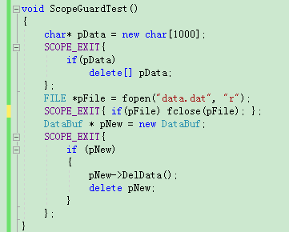

#ScopeGuard

---

C++ 11 出来后，直接使用智能指针就行了，
如：std::unique_ptr等。

---

代码提取自facebook的watchman项目

[watchman Github](https://github.com/facebook/watchman/)

-

###编译

  需要VS2015或者以后版本

-
### 用途
ScopeGuard 用于资源的安全删除。

--
###ScopeGuard用法：

直接使用宏  SCOPE_EXIT，申请资源后，在后面跟上SCOPE_EXIT删除代码，就不会忘记释放或者重复释放了。

-

MoreInfo

 *   2000年的一编文章
 *   [Change the Way You Write Exception-Safe Code]
(http://www.drdobbs.com/cpp/generic-change-the-way-you-write-excepti/184403758)

 *   Andrei's and Petru Marginean's CUJ article:
 *     http://drdobbs.com/184403758

 *   and the loki library:
 *     http://loki-lib.sourceforge.net/index.php?n=Idioms.ScopeGuardPointer
 *   and triendl.kj article:
 *     http://www.codeproject.com/KB/cpp/scope_guard.aspx

